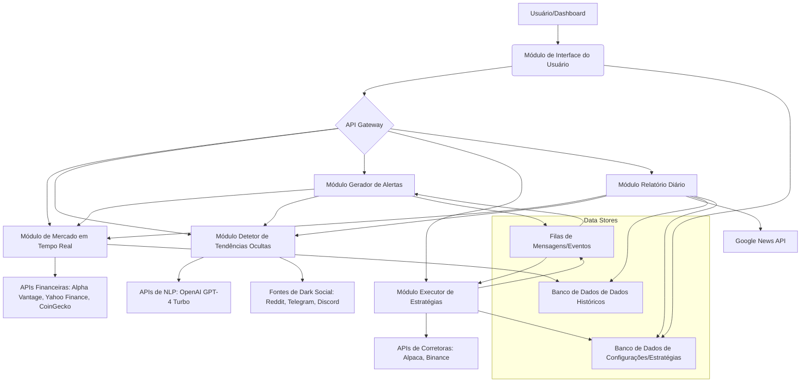

# WealthFlow Agent - Análise de Requisitos e Arquitetura do Sistema

## 1. Função Principal

O **WealthFlow Agent** atuará como um CFO Pessoal Automatizado e Operador de Mercados, focado na identificação e exploração de micro-oportunidades em mercados ineficientes (penny stocks, criptomoedas de baixa capitalização, NFTs raros) antes que algoritmos de grandes fundos as detectem. A vantagem competitiva reside na velocidade de detecção e no anonimato da operação.

## 2. Módulos Essenciais

### 2.1. Módulo de Mercado em Tempo Real

**Objetivo:** Fornecer dados financeiros e de criptomoedas em tempo real para monitoramento contínuo de ativos globais.

**Requisitos:**
- **Integração de APIs:**
  - **Dados Financeiros:** Alpha Vantage, Yahoo Finance (para ações, ETFs, etc.).
  - **Dados de Criptomoedas:** CoinGecko (para preços, capitalização de mercado, volume de negociação de criptoativos).
- **Monitoramento 24/7:** Capacidade de coletar e processar dados continuamente.
- **Cobertura:** Abranger uma ampla gama de ativos globais, incluindo ações, criptomoedas e, se possível, NFTs.
- **Frequência de Atualização:** Dados atualizados com a menor latência possível para garantir a 

atualização em tempo real.
- **Armazenamento:** Mecanismo para armazenar dados históricos para análise posterior.

### 2.2. Módulo Detetor de Tendências Ocultas

**Objetivo:** Identificar sentimentos anómalos e tendências emergentes em plataformas de 'dark social' antes que se tornem virais.

**Requisitos:**
- **Análise de NLP:** Utilização de modelos de Processamento de Linguagem Natural (NLP), especificamente OpenAI GPT-4 Turbo, para analisar texto.
- **Fontes de Dados:** Monitoramento de fóruns como Reddit (r/WallStreetBets), canais de Telegram de criptomoedas e servidores de Discord de NFTs.
- **Identificação de Palavras-chave:** Foco em palavras-chave como "squeeze", "pump", "undervalued", "announcement", entre outras relevantes para identificar movimentos de mercado.
- **Análise de Sentimento:** Capacidade de determinar o sentimento geral (positivo, negativo, neutro) e a intensidade do sentimento em relação a ativos específicos.
- **Detecção de Anomalias:** Identificar picos incomuns de menções ou mudanças abruptas no sentimento que possam indicar uma tendência emergente.
- **Filtragem de Ruído:** Mecanismos para filtrar spam, ruído e informações irrelevantes.

### 2.3. Módulo Gerador de Alertas Ações/Crypto

**Objetivo:** Configurar e disparar alertas automáticos baseados em critérios predefinidos para oportunidades de mercado.

**Requisitos:**
- **Triggers Automáticos:**
  - **Volume Anormal:** Detecção de volume de negociação significativamente acima da média em ativos de baixa capitalização.
  - **Padrões de Pump & Dump:** Identificação de padrões de negociação que sugerem manipulação de mercado (pump & dump).
  - **Notícias de Fusões e Aquisições (M&A):** Monitoramento de notícias de M&A em setores negligenciados (e.g., energia verde, inteligência artificial) que possam impactar o valor dos ativos.
- **Configuração de Critérios:** Interface para definir e ajustar os parâmetros dos alertas (e.g., percentual de aumento de volume, duração do padrão).
- **Notificações:** Envio de alertas em tempo real para o usuário através de canais configuráveis (e.g., email, SMS, notificações push).

### 2.4. Módulo Executor de Estratégias de Entrada/Saída

**Objetivo:** Executar ordens de compra e venda de forma automática em corretoras, com base em critérios predefinidos e gestão de risco.

**Requisitos:**
- **Conectividade com Corretoras:** Integração via API com corretoras de ações (e.g., Alpaca) e criptomoedas (e.g., Binance).
- **Execução de Ordens:** Capacidade de enviar ordens de mercado, limite e stop-loss automaticamente.
- **Critérios de Execução:** Suporte a critérios complexos para entrada e saída, como:
  - **Indicadores Técnicos:** RSI (Índice de Força Relativa) < 30, aumento de volume de 200%.
  - **Gestão de Lucro/Perda:** Venda com lucro de 5% em 24h, stop-loss em X%.
- **Gestão de Risco:** Implementação de lógicas de 'if-then' para gestão de risco, como:
  - **Limite de Capital:** Nunca investir mais de 2% do capital total em uma única operação.
  - **Diversificação:** Limites de exposição por ativo ou setor.
- **Monitoramento de Posições:** Acompanhamento contínuo das posições abertas e seu desempenho.

### 2.5. Módulo Relatório Diário de Oportunidades

**Objetivo:** Gerar um relatório diário automatizado com as principais oportunidades e avisos de mercado.

**Requisitos:**
- **Geração de Relatórios:** Criação de um resumo diário em formato de email/SMS.
- **Conteúdo do Relatório:**
  - **Top 3 Ativos:** Lista dos 3 principais ativos com potencial de alta, baseados em dados de mercado e análise de sentimento.
  - **Avisos de Bolhas:** Identificação de ativos ou mercados com sinais de formação de bolhas.
  - **Notícias Não Lidas:** Integração com a Google News API para identificar notícias relevantes e pouco divulgadas, com filtros de tempo.
- **Automação:** Envio automático do relatório todas as manhãs.
- **Personalização:** Opções para o usuário personalizar o conteúdo e a frequência do relatório.

## 3. Requisitos Técnicos (Para Configurar na Manus.ai)

- **Conector OpenAI:** Utilização do conector nativo da OpenAI para o módulo de análise de sentimentos (GPT-4 Turbo).
- **Orquestração de APIs:** Uso de Make.com ou Zapier para orquestrar as APIs financeiras (Alpha Vantage, Yahoo Finance, CoinGecko) e de corretoras (Alpaca, Binance).
- **Lógicas de Risco:** Implementação de lógicas de 'if-then' complexas para gestão de risco, garantindo a segurança do capital.
- **Interface:** Desenvolvimento de um dashboard simples com:
  - Botões "Ligar/Desligar" para ativar/desativar o agente.
  - Definição do capital de risco.
  - Visualização de desempenho e posições abertas.

## 4. Segredo das Baleias

O agente **WealthFlow Agent** não se destina ao trading diário. Seu foco é a **captura de micro-oportunidades em mercados ineficientes** (penny stocks, criptomoedas de baixa capitalização, NFTs raros) antes que os algoritmos dos grandes fundos as detectem. A velocidade e o anonimato são as principais vantagens competitivas.

## 5. Modelo de Receita

- **Venda de Acesso:** Assinatura mensal do agente em plataformas como Substack (€50/mês).
- **Marketplace de Estratégias:** Plataforma para usuários venderem suas configurações e estratégias vencedoras.
- **Afiliação:** Parcerias com corretoras para comissões por indicação.

## 6. Por Que Isso Vai Explodir

Este projeto visa democratizar estratégias de investimento que historicamente foram exclusivas de grandes fundos como o Renaissance Technologies. Ao permitir que usuários repliquem essas abordagens com um investimento inicial mínimo, o **WealthFlow Agent** tem o potencial de gerar um impacto significativo no mercado de investimentos pessoais.

## 7. Próximos Passos

- Detalhar a arquitetura técnica, incluindo diagramas de fluxo de dados e componentes.
- Selecionar as ferramentas e bibliotecas específicas para cada módulo.
- Planejar a implementação fase a fase, com marcos e entregáveis.

## 8. Arquitetura Técnica Proposta

A arquitetura do WealthFlow Agent será modular e escalável, permitindo a integração de novos módulos e a atualização de tecnologias sem impactar o sistema como um todo. A comunicação entre os módulos será baseada em APIs e, quando aplicável, em filas de mensagens para garantir a resiliência e o processamento assíncrono.

### 8.1. Diagrama de Arquitetura (Conceitual)

### 8.2. Tecnologias e Ferramentas Propostas

- **Linguagem de Programação:** Python (devido à vasta biblioteca para análise de dados, machine learning e integração de APIs).
- **Framework Web (para Dashboard):** Flask (leve e flexível para a interface de usuário e API Gateway).
- **Banco de Dados:** PostgreSQL (para dados históricos e configurações, devido à robustez e escalabilidade).
- **Filas de Mensagens:** RabbitMQ ou Apache Kafka (para comunicação assíncrona entre módulos e processamento de eventos).
- **Orquestração de APIs:** Make.com ou Zapier (conforme solicitado, para simplificar a integração com APIs externas).
- **Análise de Sentimentos:** OpenAI GPT-4 Turbo (via API).
- **APIs Financeiras:** Alpha Vantage, Yahoo Finance, CoinGecko.
- **APIs de Corretoras:** Alpaca, Binance.
- **Notícias:** Google News API.
- **Monitoramento e Logging:** Prometheus/Grafana (para monitorar a saúde do sistema e o desempenho das estratégias).
- **Controle de Versão:** Git.
- **Ambiente de Execução:** Docker (para conteinerização dos módulos, facilitando a implantação e escalabilidade).

## 9. Plano de Implementação (Fases Detalhadas)

Esta seção detalha as fases de implementação, alinhadas com o plano de tarefas geral.

### Fase 1: Análise de Requisitos e Arquitetura do Sistema (Concluída)
- Detalhar os requisitos de cada módulo.
- Projetar a arquitetura geral do sistema.
- Definir as tecnologias e ferramentas a serem utilizadas.
- Criar um diagrama de arquitetura.
- Documentar o plano de implementação.

### Fase 2: Pesquisa e Integração de APIs Financeiras
- Pesquisar e selecionar as APIs financeiras mais adequadas (Alpha Vantage, Yahoo Finance, CoinGecko).
- Desenvolver conectores para cada API.
- Implementar a coleta e armazenamento de dados em tempo real.
- Validar a integridade e a frequência dos dados.

### Fase 3: Desenvolvimento do Módulo de Análise de Sentimentos
- Configurar o acesso à API OpenAI GPT-4 Turbo.
- Desenvolver o crawler para coletar dados de 'dark social' (Reddit, Telegram, Discord).
- Implementar a lógica de análise de NLP para identificar palavras-chave e sentimentos.
- Desenvolver mecanismos de filtragem de ruído.

### Fase 4: Implementação do Sistema de Alertas e Triggers
- Desenvolver a lógica para detecção de volume anormal, padrões de pump & dump e notícias de M&A.
- Implementar o sistema de triggers automáticos.
- Configurar o envio de notificações (email, SMS).

### Fase 5: Desenvolvimento do Executor de Estratégias
- Integrar com as APIs das corretoras (Alpaca, Binance).
- Implementar a lógica de execução de ordens baseada em critérios predefinidos.
- Desenvolver o módulo de gestão de risco (limite de capital, stop-loss).
- Implementar o monitoramento de posições.

### Fase 6: Criação do Sistema de Relatórios Automáticos
- Desenvolver a lógica para gerar o conteúdo do relatório diário (top 3 ativos, avisos de bolhas, notícias).
- Integrar com a Google News API.
- Implementar o envio automático do relatório por email/SMS.

### Fase 7: Desenvolvimento da Interface de Usuário
- Projetar e desenvolver o dashboard (Flask frontend).
- Implementar os botões "Ligar/Desligar" e a configuração de capital de risco.
- Desenvolver a visualização de desempenho e posições.

### Fase 8: Testes e Implementação do Sistema Completo
- Realizar testes unitários e de integração em todos os módulos.
- Conduzir testes de ponta a ponta para validar o fluxo completo.
- Otimizar o desempenho e a escalabilidade.
- Preparar o ambiente para implantação.

### Fase 9: Documentação e Entrega do Projeto
- Finalizar a documentação técnica e de usuário.
- Criar guias de instalação e configuração.
- Apresentar o projeto final e seus resultados.

### 9.1. Pesquisa e Seleção de APIs Financeiras

Para o módulo de **Mercado em Tempo Real**, foram pesquisadas e avaliadas as seguintes APIs:

- **Alpha Vantage:**
  - **Capacidades:** Oferece dados financeiros em tempo real e históricos para ações globais, ETFs, FOREX, e criptomoedas. Inclui mais de 50 indicadores técnicos. Os dados são fornecidos em formatos JSON e Excel.
  - **Vantagens:** Ampla cobertura de dados, incluindo indicadores técnicos, e uma camada gratuita para uso limitado (25 requisições/dia).
  - **Considerações:** O limite da camada gratuita pode ser restritivo para monitoramento 24/7 de múltiplos ativos, exigindo a consideração de um plano premium ou a combinação com outras APIs.
  - **Referência:** [1] Alpha Vantage API Documentation, [2] Alpha Vantage: Free Stock APIs in JSON & Excel

- **Yahoo Finance:**
  - **Capacidades:** Fornece acesso a dados históricos e em tempo real para uma variedade de mercados financeiros e produtos, como cotações de ações, informações de empresas e dados históricos de preços.
  - **Vantagens:** Amplamente utilizado, dados abrangentes e a existência de bibliotecas não oficiais como `yfinance` que simplificam o acesso aos dados.
  - **Considerações:** A ausência de uma API oficial e a dependência de métodos não oficiais podem apresentar riscos de estabilidade e manutenção a longo prazo.
  - **Referência:** [3] Yahoo Finance API - A Complete Guide, [4] ranaroussi/yfinance: Download market data from Yahoo! Finance's API

- **CoinGecko:**
  - **Capacidades:** Oferece dados abrangentes e confiáveis do mercado de criptomoedas, incluindo preços em tempo real e históricos, dados de mercado on-chain, informações de exchanges para mais de 14 milhões de moedas em 248 redes.
  - **Vantagens:** Cobertura extensiva de criptomoedas, dados detalhados e uma API gratuita robusta para a maioria dos casos de uso.
  - **Considerações:** Essencial para o componente de criptomoedas do WealthFlow Agent.
  - **Referência:** [5] CoinGecko API Documentation, [6] Most Comprehensive Cryptocurrency Price & Market Data API

**Conclusão da Seleção:**

Para o **WealthFlow Agent**, a combinação dessas três APIs é ideal para garantir uma cobertura abrangente de dados financeiros e de criptomoedas. A Alpha Vantage será utilizada para dados de ações e indicadores técnicos, o Yahoo Finance (via `yfinance`) como um complemento para dados históricos e cotações, e o CoinGecko será a fonte primária para todos os dados de criptomoedas. A orquestração dessas APIs será realizada conforme o plano, utilizando Make.com ou Zapier, ou desenvolvendo conectores diretos em Python, dependendo da complexidade e da necessidade de personalização.

### 9.2. Desenvolvimento de Conectores para Cada API

Nesta etapa, serão desenvolvidos os módulos de código responsáveis por interagir com cada uma das APIs selecionadas. Isso incluirá:

- **Autenticação:** Implementação dos mecanismos de autenticação necessários para cada API (chaves de API, OAuth, etc.).
- **Requisições:** Construção das requisições HTTP para buscar os dados desejados (cotações, dados históricos, volume, etc.).
- **Tratamento de Respostas:** Parsing e validação das respostas JSON/XML das APIs.
- **Tratamento de Erros:** Implementação de lógica para lidar com limites de taxa, erros de conexão e outros problemas da API.

### 9.3. Implementação da Coleta e Armazenamento de Dados em Tempo Real

Será projetado e implementado um sistema para coletar dados das APIs de forma contínua e armazená-los. Isso pode envolver:

- **Agendamento:** Utilização de tarefas agendadas (cron jobs ou serviços de fila) para disparar as requisições às APIs em intervalos regulares.
- **Normalização de Dados:** Padronização dos dados coletados de diferentes fontes para um formato unificado.
- **Armazenamento:** Persistência dos dados em um banco de dados (PostgreSQL, conforme arquitetura proposta) para acesso rápido e análise histórica.

### 9.4. Validação da Integridade e Frequência dos Dados

Após a implementação da coleta e armazenamento, será crucial validar a qualidade dos dados:

- **Verificação de Integridade:** Checagem de dados ausentes, duplicados ou corrompidos.
- **Consistência:** Comparação de dados de diferentes fontes quando possível para garantir a consistência.
- **Frequência:** Confirmação de que os dados estão sendo atualizados na frequência esperada (em tempo real ou com a menor latência possível).

### Referências:
[1] Alpha Vantage API Documentation. Disponível em: https://www.alphavantage.co/documentation/
[2] Alpha Vantage: Free Stock APIs in JSON & Excel. Disponível em: https://www.alphavantage.co/
[3] Yahoo Finance API - A Complete Guide. Disponível em: https://algotrading101.com/learn/yahoo-finance-api-guide/
[4] ranaroussi/yfinance: Download market data from Yahoo! Finance's API. Disponível em: https://github.com/ranaroussi/yfinance
[5] CoinGecko API Documentation. Disponível em: https://docs.coingecko.com/reference/introduction
[6] Most Comprehensive Cryptocurrency Price & Market Data API. Disponível em: https://www.coingecko.com/en/api

